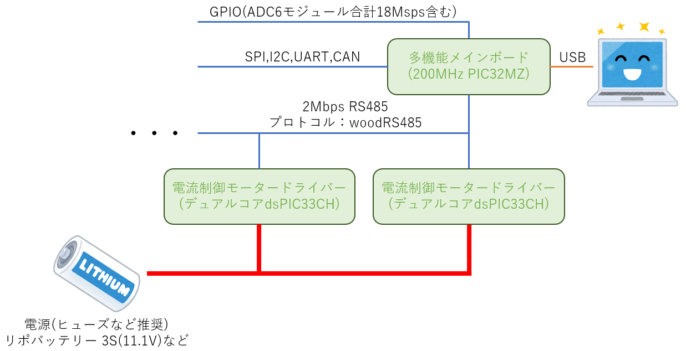
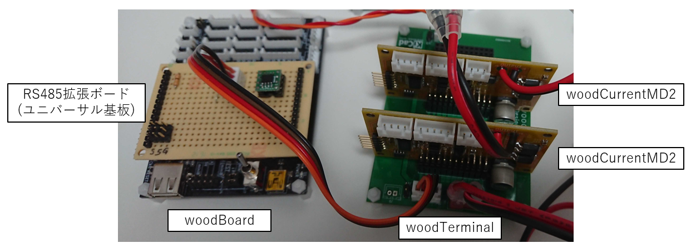

# woodRobotCircuit-board
趣味でロボコン的なロボットを動かす回路を作ろうプロジェクト（？）の回路・基板リポジトリである。ファームウェアは[ここ](https://github.com/woodrobo/woodRobotCircuit-firmware)。
ロボコンや趣味のロボット製作等の参考にどうぞ。  

  
  

メインボードとモータードライバは2MbpsのRS485で接続されており、プロトコルはwoodRS485という独自規格を用いているが、これも[リポジトリ](https://github.com/woodrobo/wood_rs485)として公開されており、C言語が使用できるマイコンであればどのマイコンでも移植できるよう実装されている。  
モータードライバーは電流制御に対応しており高度な制御が可能となる。  

# 電流制御とは
モーターは一般に抵抗とコイル、そして回転速度に比例する逆起電力の3つが直列接続されたモデルで表現されます。  

$$ Vin = Ri + L\frac{di}{dt}+V$$

電子工作でよく使用されるPWM制御ではこの3つの要素全体にかける電圧を制御しているのでこれは直接的に物理的な意味を持ちません。モーターに流れる電流はトルクに比例すると言われこの電流を制御する電流制御方式ではトルクという物理量を直接的に扱うことができます。

$$ \tau = K_t i $$

製品や研究の世界ではこのトルク制御により運動方程式からモデルを立てて制御をすることが一般となっています。例えばロボティクスでは動力学や逆動力学によりロボットアームを制御しています。モデルに基づいた制御をするために電流制御は必須の機能です。

# 基板の簡単な紹介
woodBoard  
メインボードでありRS485以外にもSPI,I2C,UART,CANなどの通信ポートを備えている。また余った全てのGPIOをピンソケットに出しており、3MbpsのADCモジュールが6つ搭載されているため合計で18Mspsもの高速なAD変換を実現できる。もちろんこれはモジュール数であるのでAD変換可能なピン数はこれより多い。

woodTerminal  
モータードライバー基板などをまとめるための基板であり、1つのターミナル基板につきモータードライバー基板を5枚配置することができる。制御側の電源はRS485ポートの5V電源のほか、DCDCコンバータが搭載されているのでLiPo 3S(11.1V)等からも5Vを生成できる。
  
woodCurrentMD  
初期のモータードライバーであるが、ゲートドライバICが手に入らなかったことや回路トラブルにより闇の基板だぞ。

woodCurrentMD2  
20kHz電流制御モータードライバー。ロジック側とパワー側はフォトカプラで絶縁されており、モーター電流は磁気式の電流センサで計測している。UARTポート、エンコーダポート、ADCポートを搭載しており、また搭載しているマイコンはマルチプレクサにより自由にピン配置を変更できるため拡張性に優れる。180MHz/200MHzデュアルコアマイコンdsPIC33CHにより電流制御とその他処理をコアで分離するためプログラムの拡張性に優れる。  

# 基板発売について  
ここのサイトで基板のみを売ってるぞ！  
URLはる