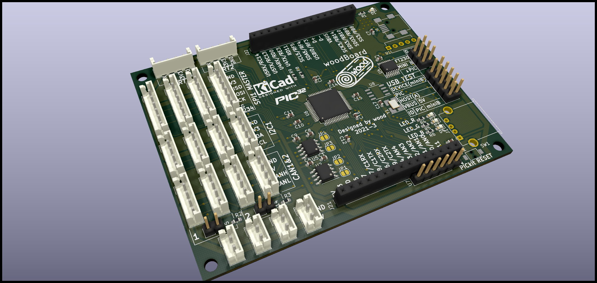
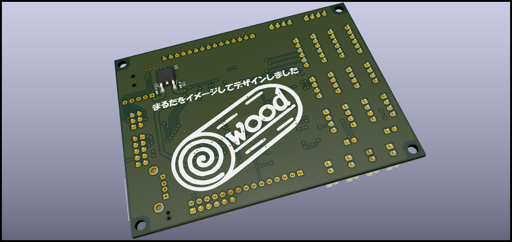

# woodBoard
ロボット回路のメインボード

趣味でロボコン的なロボットを動かす回路を作ろうプロジェクト（？）のメインボードである。  
PIC32MZを使用しており200MHz/330DMIPSらしい。（たぶん）  
woodBoardの特徴を説明すると  
- 通信ポートが豊富(アドレスが被っても安心設計)
    - CAN通信2ポート(各ポートに2つコネクタ搭載、終端抵抗ジャンパピンで設定可能)  
    - SPI通信2ポート(そのうち1つのポートはSS違いで4つコネクタ配置、もう1つはピンソケット)
    - I2C通信2ポート(そのうち1つのポートは4つコネクタ配置、もう1つはピンソケット)
    - UART5ポート(USBシリアルに1,通信ポートに2,ピンソケットに2)
- ほとんど秋月電子で部品購入可能
    - 一部は秋月電子で購入できないが
    - EHコネクタ->お好きなコネクタに変更
    - MCP2562->DIP品なら秋月電子で売っているのでピンソケットからCANTX,CANRXを取り出せば動作可能
    - 表面実装の24MHz水晶->スルーホール部品を"気合"または、違う周波数に変更する（ただしUSB通信をするには12MHzまたは24MHz）
  
    
    
  
  # 部品について  
  部品表.csvおよび部品個数表.csvを見てくれ。