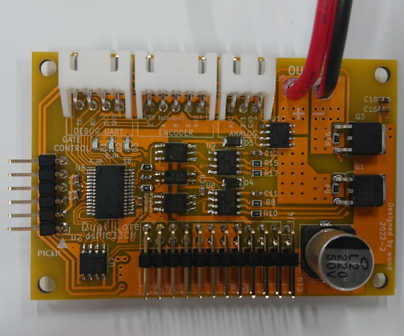
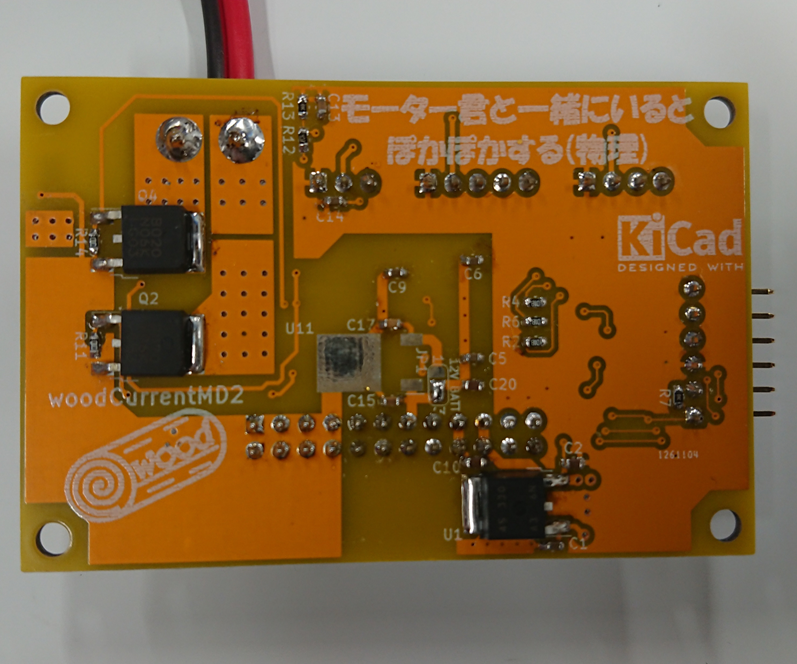

# woodCurrentMD2
2Mbps RS485対応電流制御DCモータードライバー

仕様
- 通信規格2Mbps RS485
	- 受信：電圧制御(PWM値)、電流制御
	- 送信：電流値、AD変換ポートの値、(実装中のため存在しない)エンコーダのカウント値
- 20kHz電流制御
- デバッグUARTポート
	- 現状RXから信号が出てる()
- インクリメンタル型エンコーダポート
	- PICのQEI機能でハードウェア処理(予定)
- (ポテンショなどの)AD変換ポート

通信規格  
woodRS485で以下のデータをやり取りする。

**マイコンボード→モータードライバー**  
モードは0で電圧制御(PWM値)、1で電流制御を意味する。16bit値は16bitのsigned int型であり、電圧制御ではPWM値(-10000 ~ 10000)を指示し、電流制御では1当たり0.0179[A]となる。  
例えば、電圧制御PWM1000ならば「0,3,232」となる。電流制御1Aならば「1,0,56」(1.0024A)となる。

| バイト数 | データ |
----|---- 
| 1 | モード |
| 2 | 16bit値(上位バイト) |
| 3 | 16bit値(下位バイト) |

**モータードライバー→マイコンボード**  
電流値は16bitのsigned int型であり、1あたり0.0179[A]を意味する。AD変換ポートはAD変換値(12bit 0-4095)が入っている。 

| バイト数 | データ |
----|---- 
| 1 | 電流値(上位バイト) |
| 2 | 電流値(下位バイト) |
| 3 | AD変換ポート(上位バイト) |
| 4 | AD変換ポート(下位バイト) |

    
    
  
  # 部品について  
  部品表.csvおよび部品個数表.csvを見てくれ。